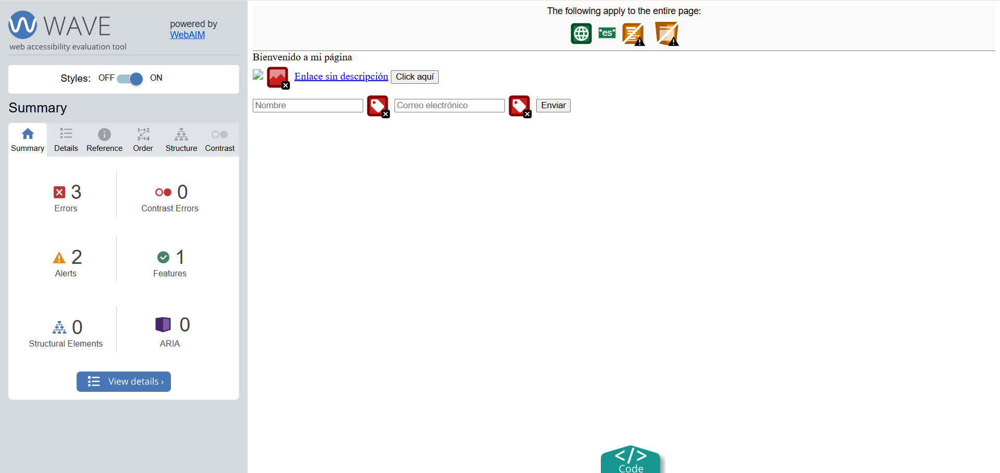
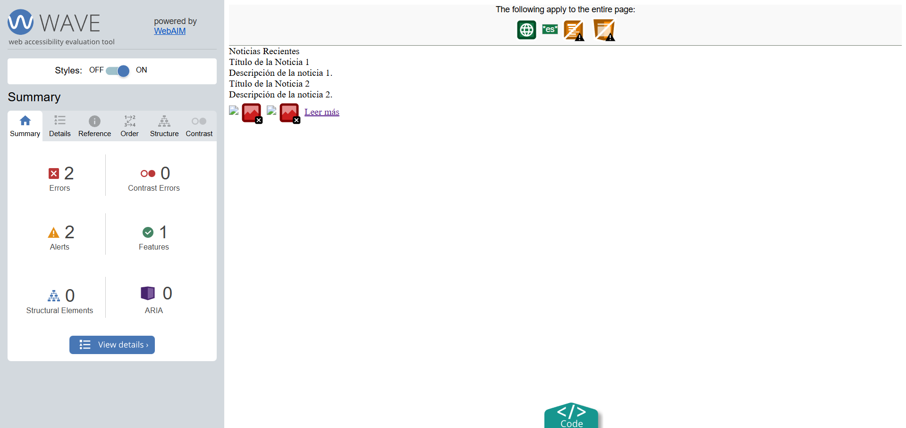
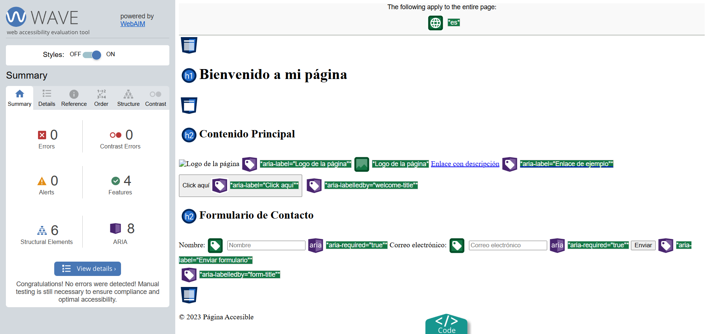
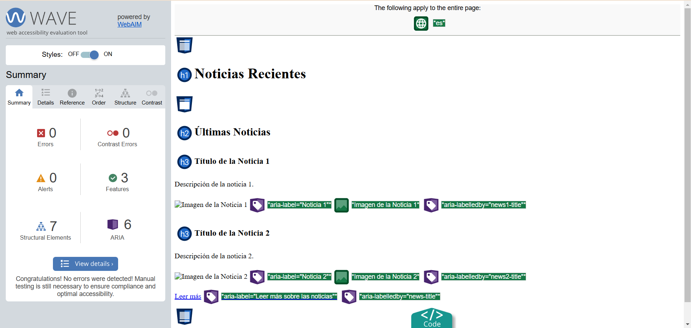
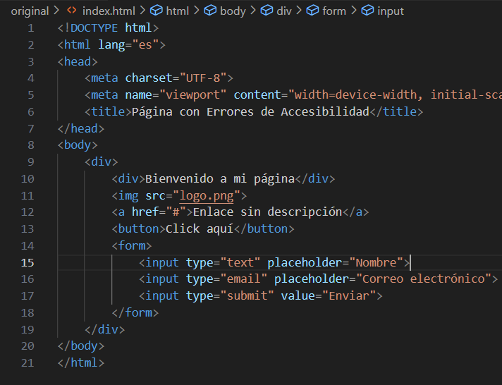
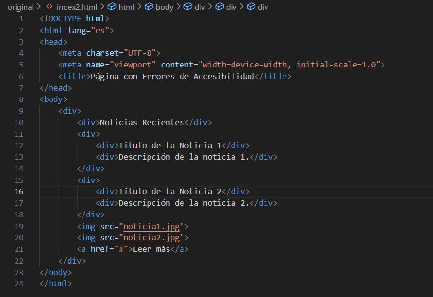
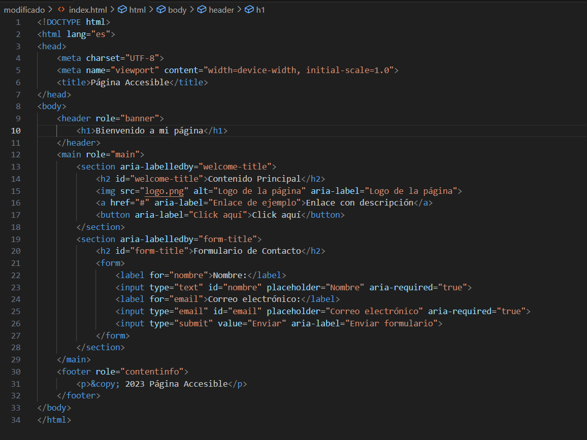
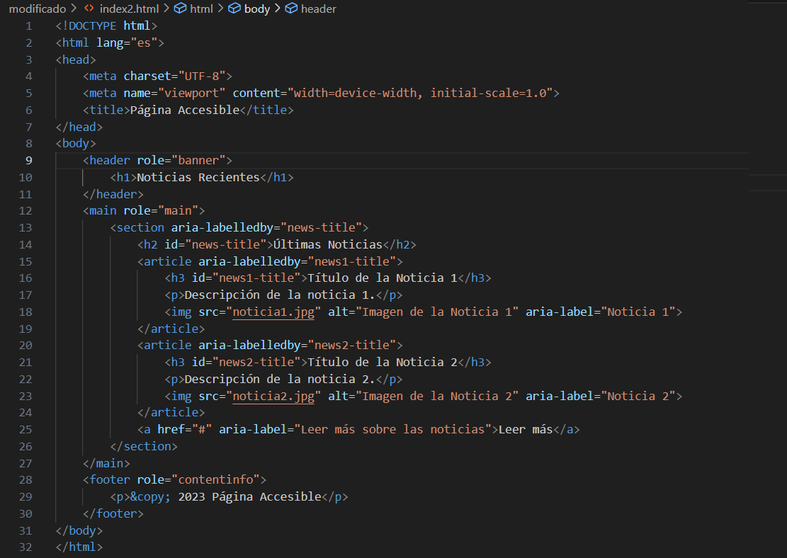
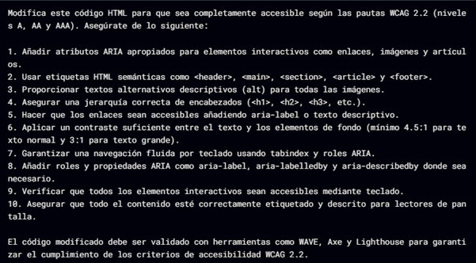
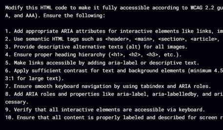

### Readme en Español

### Accesibilidad y Copilot 
## Original Wave

<h3>index.htnml</h3>

<h3>index2.html</h3>

## Modificado Wave

<h3>index.html</h3>

<h3>index2.html</h3>

## Codigo Original

<h3>index.html</h3>

<h3>index2.html</h3>

## Codigo Modificado

<h3>index.html</h3>

<h3>index2.html</h3>

# Consulta con copilot

______________________________________________________________________________________________________________________________________________________________________________________________________________________________________________________________________________________________________

### Readme to English

### Accessibility and Copilot 
## Original Wave

<h3>index.html</h3>

<h3>index2.html</h3>

## Modified Wave

<h3>index.html</h3>

<h3>index2.html</h3>

## Original Code

<h3>index.html</h3>

<h3>index2.html</h3>

## Modified Code

<h3>index.html</h3>

<h3>index2.html</h3>

# Consultation with Copilot

